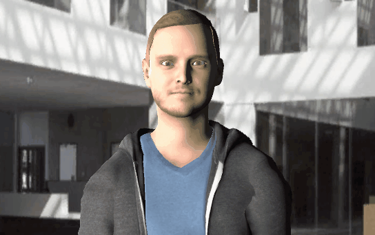

# Mike the Pedagogical Agent

Welcome to the official repository of Mike The pedagogical agent v2.0 now powered by LLMs.

This is a Unity3D project which was originally created for a CentraleSupelec Lecture on Artificial Intelligence and Social Sciences.

This project contains the foundation of a Socially Interactive Agent or Embodied Conversational Agent.
It is greatly inspired by other projects such as Greta, Marc and the Virtual Human Toolkit.
It was not really designed to fully reproduce the capacity of a SIA, but to offer an easy way for students to discover how an agent can work.

# Installation

You can clone the current project using your favorite Git Client or you can download it as a zip archive and extract it on your drive.

Mike the PA should work on Linux, Windows and MacOS versions of Unity3D starting from version 2021.3.

As a Unity3D project, you need to add the project in your project's list using UnityHub "Add Project" functionality.

# Usage

The project should open on a blank scene. Open the CS_Scene to load the default scene. If you are familiar with Unity3D, you should get around quite easily.

The scene only has a fake background, a Camera, some lighting and our agent. The agent is a GameObject equipped with custom scripts in order to allow him to :
- Run a dialog using an external LLM, UI Buttons are used to start and stop recording your voice.  
- Follow an object with its gaze
- Perform some pre-rendered animations (downloaded from Mixamo)
- Do basic lip animation mixed with facial expressions

The project is quite light and straightforward. It does not compete with other exising agent plaforms such as [Greta](https://github.com/isir/greta), Marc or [VHTK](https://vhtoolkit.ict.usc.edu/) but can be a good playground to manipulate an interactive character.

# The DialogManager

> ## The original button-based dialog manager (deprecated)
> 
> The big part of this project was its DialogManager. You can follow the existing dialog examples to understand how it works in the zip folder.
> 
> A dialog is represented by both a JSON file, listing questions and possible answers, and a C# class inheriting from the Chatbot class, which can be used to add computational logic to the dialog.
> 
> During the dialog, the DialogManager is retrieving the possible answers of a question for adding the corresponding buttons to the interface.
> 
> The DialogManager expects to find pre-recorded audio files in the Resources folder (with file names corresponding to questions' id) in order to produce the agent's audio responses.
> However, it is also possible to use OpenMary as well for real-time text-to-speech.

## The real-time voice (LLM and Whisper) dialog manager
Now, MikeTPA 2.0 uses a LLMDialogManager class which is implemented to serve as a demo for integrating modern AI solutions for Speech-To-Text and LLMs. This class uses Macoron plugin [WHISPER.Unity](https://github.com/Macoron/whisper.unity). The resulting dialog can be quite slow and imprecise, depending on you connection and the size of the LLM you are using, but it can be used as a starting point to integrate online, more precise and faster solutions. Please note that the model for the Whisper plugin is not distributed here and should be retrieved by following Macoron's instructions on his respective repositories.

# Credits

Original 3D Model from [Mike Alger](https://mikealger.com/portfolio/avatar#top), prerendered animations from [Mixamo](https://www.mixamo.com)

Thanks to Julien Saunier for the OpenMary integration. 